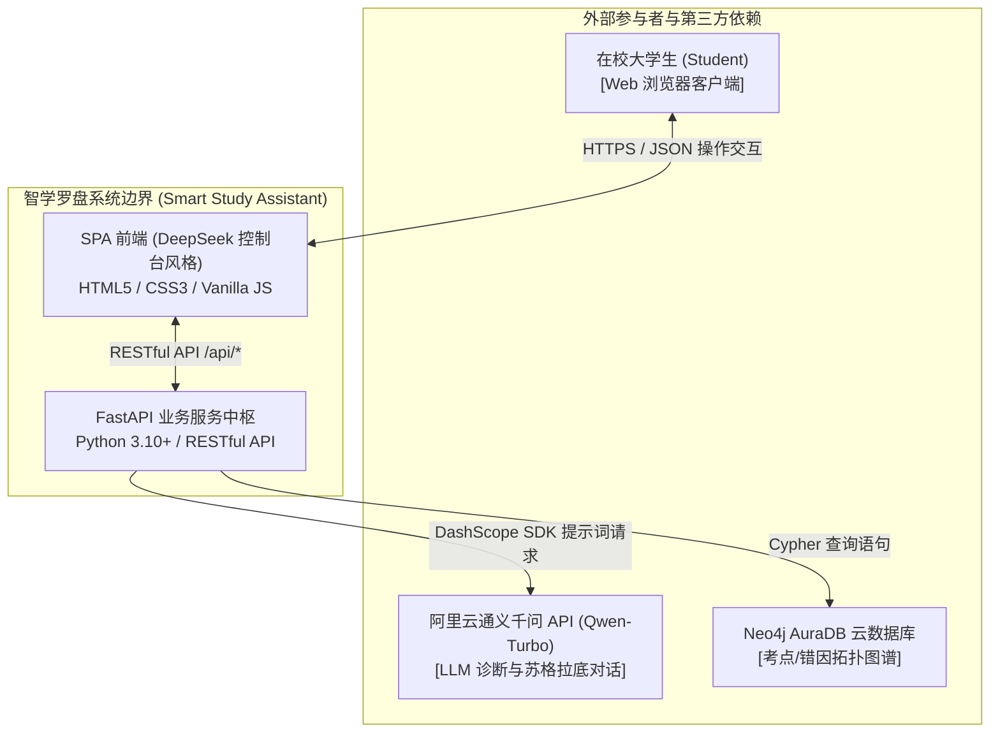
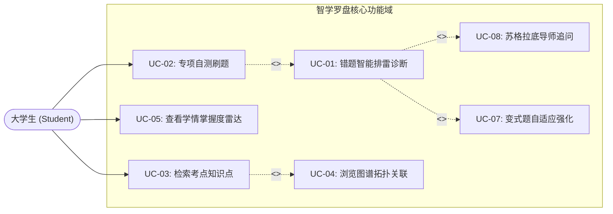
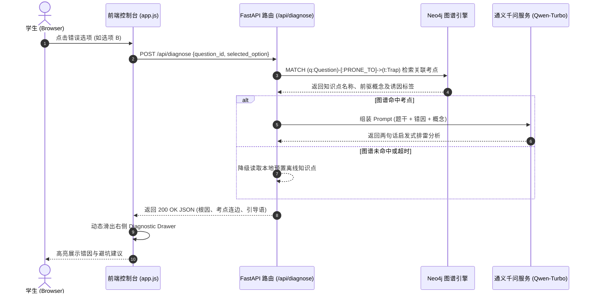

# 🏛️ JC2001 Group 5 开工任务包（二）：系统架构与交互设计组

**责任人**：王思鉴 (50106045，系统架构师)、习羽赛 (50105989，UI/UX 交互设计)  
**对接组长**：吴宇轩 (50106070) | **审核人**：江昊 (50106065)  
**关键交付节点**：**2026 年 10 月 10 日（周六）晚 22:00（支撑 M2.1 与 M2.2 启动）**  
**预计投入时间**：每人约 4–5 小时

---

## 🎯 本周核心目标
将需求组（泳桐、梓健）的用例规约与现有控制台前端，**升华为符合 Ian Sommerville 经典软工规范的 UML 架构图件与交互契约**。  
你们产出的图件将直接用于 **40–60 页技术报告中第 3 章（Modelling）与第 4 章（System Design and Architecture）的核心配图**。

---

## 📌 你们需要完成的交付物清单

### 交付物 1（王思鉴主责）：三大标准 UML 架构图件（含 Mermaid 骨架）
请基于以下预置好的 Mermaid 代码，在 [Mermaid Live Editor](https://mermaid.live) 或 Draw.io 中调整并导出高清图件（保存至 `reports/figures/` 目录，命名清晰）：

#### 图 1：系统顶层上下文模型（System Context Model）
划定系统边界，明确智学罗盘与外部角色及外部第三方服务的交互：

#### 图 2：全局 UML 用例图（Global Use Case Diagram）
展示参与者与各用例之间的关系，务必体现 `<<include>>`（包含依赖）与 `<<extend>>`（扩展依赖）：

#### 图 3：核心业务时序图（Sequence Diagram - 错题排雷全流程）
展现前端、后端路由、图谱检索与大模型服务的交互时序：

---

### 交付物 2（习羽赛主责）：前端-后端接口字段映射对照表
对照现有的 `frontend/app.js` 与 `frontend/index.html`，梳理前端发起的请求入参与期望接收的出参字段，防止后续联调报错：

| 视图/模块 | 前端触发动作 | 调用的后端 URL | 请求方法 | 关键请求字段 (Request Body) | 期望返回字段 (Response Body) |
| :---: | :--- | :--- | :---: | :--- | :--- |
| **专项刷题** | 切换学科加载题目 | `/api/quiz` | `GET` | `?subject=economics&limit=5` | `questions: [{id, stem, options, subject}]` |
| **智能排雷** | 用户点击错误选项 | `/api/diagnose` | `POST` | `{question_id, selected_option}` | `{is_correct: false, trap_name, concept, analysis}` |
| **学情分析** | 刷新掌握度雷达图 | `/api/analytics/radar` | `GET` | `?student_id=50106070` | `{dimensions: [...], scores: [80, 65, 90, ...], weak_points: [...]}` |
| **导师对话** | 用户在抽屉输入提问 | `/api/chat` | `POST` | `{question_id, user_message, history}` | `{reply_text, follow_up_hints}` |

---

## 🛠️ 组员实操与提交指引
1. **王思鉴**：将上述 3 张图的代码在 Mermaid Live 中微调，导出清晰的 `.png` 或 `.svg`，放置到项目目录 `reports/figures/` 下（如 `fig_context_model.png`、`fig_use_case_diagram.png`、`fig_seq_diagnose.png`）；
2. **习羽赛**：将字段对照表写成 Markdown，放置于 `reports/api_frontend_mapping.md`；
3. **Git 提交**：
   - 王思鉴分支：`feature/wangsijian-uml-diagrams`
   - 习羽赛分支：`feature/xiyusai-interaction-mapping`
   - 提交命令：`git commit -m "wangsijian: add context model, use case diagram and sequence diagram"`
4. **完成时间**：**10 月 10 日（周六）晚 22:00 前**。
